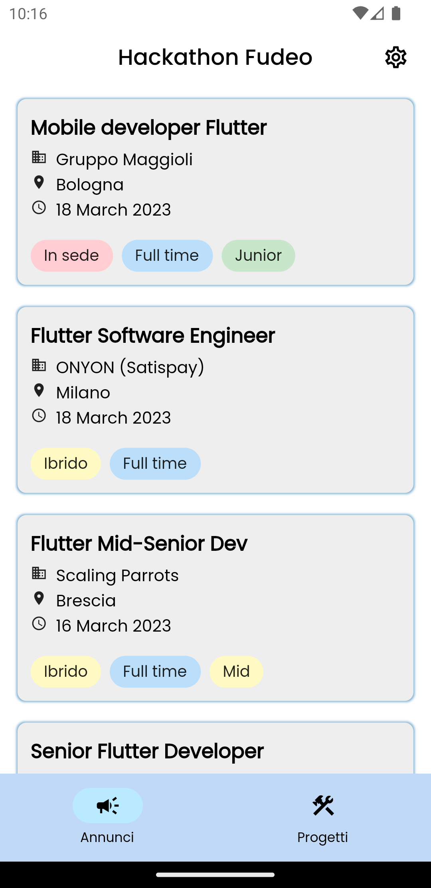
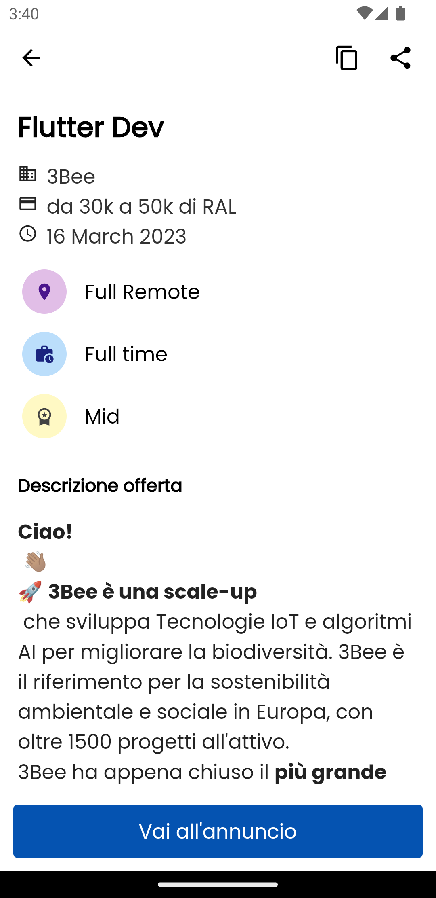
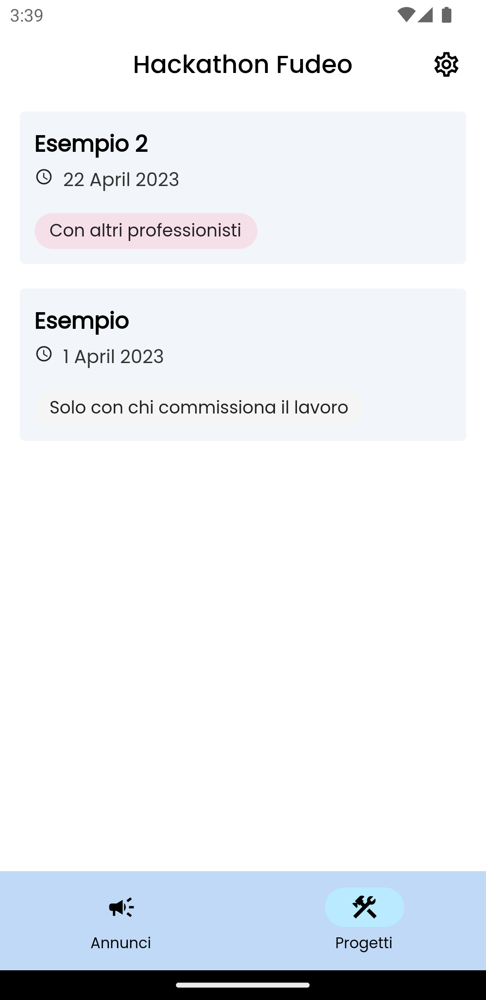
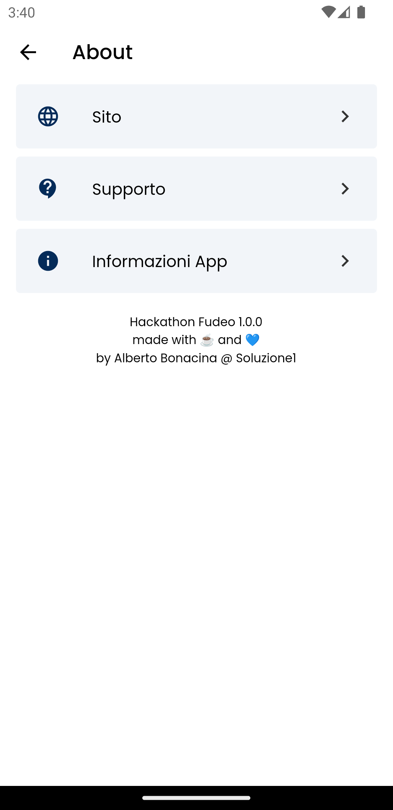
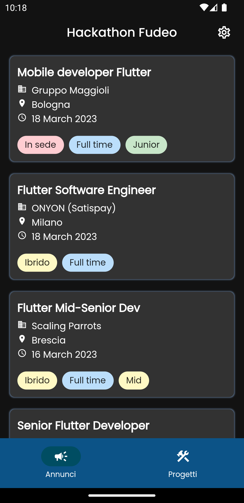
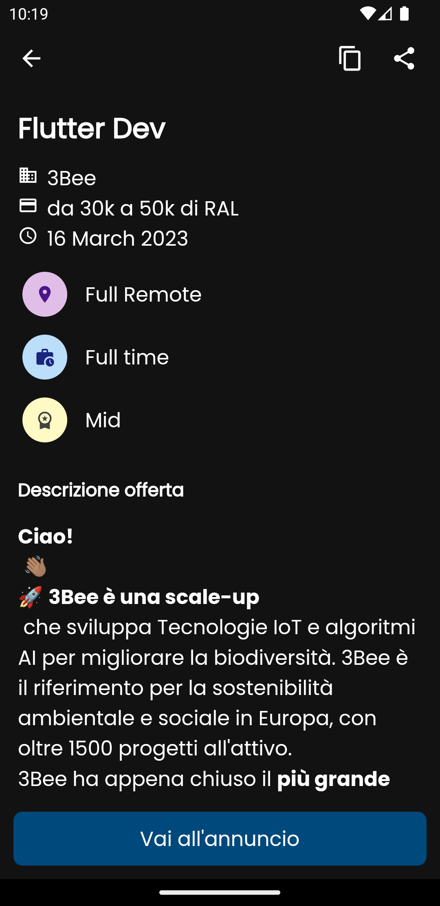
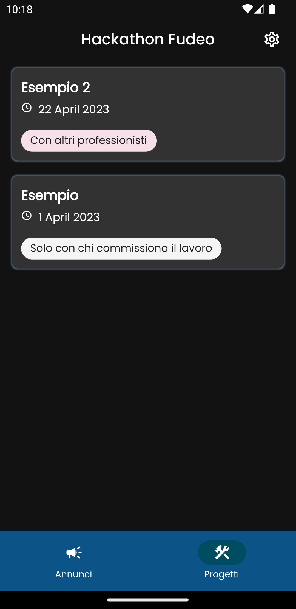
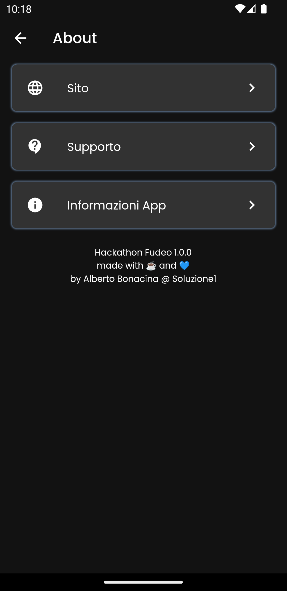

<div align="center">
  
  <h1>Hackathon Fudeo Offertelavoroflutter.it</h1>
  <p align="center">
  <a href="https://dart.dev/"></a>
  <a href="https://flutter.dev/"></a>
  </p>
</div>

Applicazione realizzata da [Soluzione1](https://www.soluzione1.it/) per l'[Hackathon Flutter](https://www.fudeo.it/blog/hackathon-flutter-offertelavoroflutter) organizzata da [Fudeo](https://www.fudeo.it/) svoltosi dal 1 aprile fino al 1 maggio 2023, che prevedeva la realizzazione di una applicazione per visualizzare gli annunci di lavoro presi dal sito [Offertelavoroflutter.it](https://offertelavoroflutter.it/).

### 💎 Features

* [X] Visualizzazione lista degli annunci
* [X] Visualizzazione del singolo annuncio
  * [X] Condivisione annuncio tramite qrcode
  * [X] Copia del link dell'annuncio
* [X] Visualizzazione lista di progetti
* [X] Visualizzazione del singolo progetto
  * [X] Condivisione progetto tramite qrcode
  * [X] Copia del link del progetto
* [X] About page con le informazioni sulla app
  * [X] Link al sito di presentazione
  * [X] Mail alla pagina di supporto
  * [X] Lista delle licenze dei package utilizzati
* [X] Tema applicazione che si adatta al light/dark mode del dispositivo

### 📱 Screenshots

| Lista Annunci | Singolo Annuncio | Lista progetti | Singolo progetto | About |  
|-|-|-|-|-|
|  |  |  |  | | 
|  |  |  |  | | 


### 🧬 Environment

La struttura del file `.env` da creare nella root del progetto è di questo tipo

```env
NOTION_BASE_URL="https://api.notion.com/v1/databases"
NOTION_SECRET_KEY="secret_XXXXX"
NOTION_DB_ANNUNCI="283d2760f81548f0a7baca4b3e58d7d8"
NOTION_DB_PROGETTI="e6a8a6760e3d4430b20a15d16f75f92e"
NOTION_API_VERSION="2022-06-28"
```

una volta creato il file e aggiunte le variabili corrette è necessario lanciare `build_runner` dando da terminale

```bash
flutter pub run build_runner build --delete-conflicting-outputs
```

## 📋 License

```
Copyright 2023 Soluzione 1 Srl

Licensed under the Apache License, Version 2.0 (the "License");
you may not use this file except in compliance with the License.
You may obtain a copy of the License at

   http://www.apache.org/licenses/LICENSE-2.0

Unless required by applicable law or agreed to in writing, software
distributed under the License is distributed on an "AS IS" BASIS,
WITHOUT WARRANTIES OR CONDITIONS OF ANY KIND, either express or implied.
See the License for the specific language governing permissions and
limi